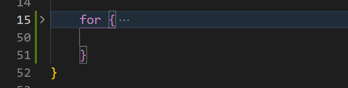
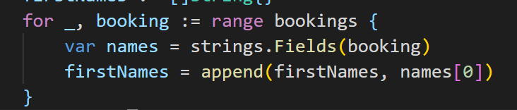
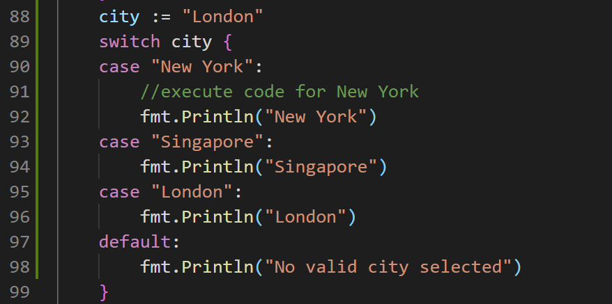

# booking-app

learning go

array 是固定长度的一种类型，而 slice 是内存大小动态开辟的一种类型

关于循环：

for {

}是一种无循环次数的循环，可以在cmd中使用ctrl + c停止循环

在遍历切片的过程中，可以使用for循环进行

在遍历的过程当中，需要两个值进行遍历，如果命名为index, booking的话，然而并没有使用到index，所以说可以使用空白标识符"_"来标识一下，表示这里有一个东西在遍历的过程中需要用到，但是在代码逻辑上没有使用到，所以说要使用一个下划线来进行处理

因为对于一个for循环上可以加入条件，所以说关于死循环，还可以写成

for true {

}这个样子来进行处理，将意味着是一个死循环

多条件适用switch语句：

使用switch语句进行编程可能会简化代码
