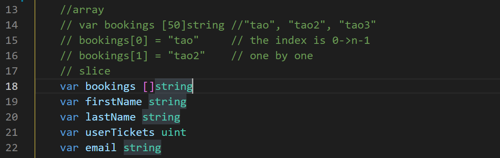
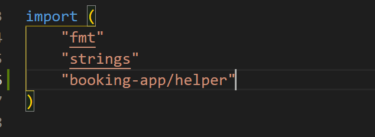
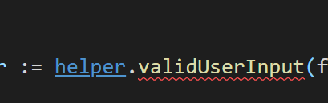
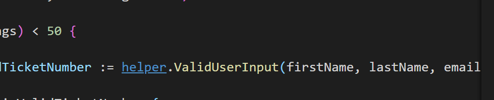
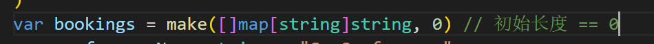
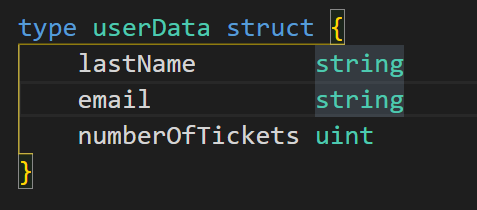
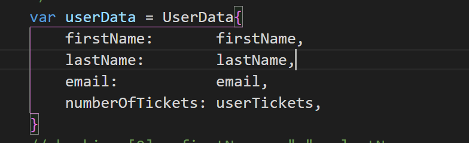

# booking-app

learning go note

## 变量

package级别的变量可以在任何地方进行访问，所以说可以在给函数等传递参数上进行很大一部分节省

## 数组和切片

array 是固定长度的一种类型，而 slice 是内存大小动态开辟的一种类型

关于循环：


数组可以对指定下标的进行赋值，切片也是可以的，但是一开始为空，并且不好确定长度所以说我们可以对已经有的元素进行值的指定

```go
// bookings[0] = firstName + " " + lastName
// append添加一个元素到切片的末尾，并返回一个添加后的切片，显然可以直接赋给bookings
bookings = append(bookings, firstName+" "+lastName)
```

切片长度的确定可以使用 `len(sliceName)`来确定



## 循环 & 选择

for {

}是一种无循环次数的循环，可以在cmd中使用ctrl + c停止循环

在遍历切片的过程中，可以使用for循环进行


在遍历的过程当中，需要两个值进行遍历，如果命名为index, booking的话，然而并没有使用到index，所以说可以使用空白标识符"_"来标识一下，表示这里有一个东西在遍历的过程中需要用到，但是在代码逻辑上没有使用到，所以说要使用一个下划线来进行处理

因为对于一个for循环上可以加入条件，所以说关于死循环，还可以写成

for true {

}这个样子来进行处理，将意味着是一个死循环

条件较少的情况下：

if {

}或者是

if 条件1 {

}else if 条件2 {

}或者是

if 条件1 {

} else if 条件2 {

}....

else {

}

多条件适用switch语句：


使用switch语句进行编程可能会简化代码

## 函数

可以使用func定义一个函数

```go
.func funcName(param1 type1,.....) return type{
}
```

因为go的函数可以返回多个值，所以说，在对于返回多个返回值的函数的返回类型声明中，可以逐个的声明返回类型，并且用圆括号包括起来，比如：

```go
func funcName(para1 para1Type,para2 para2Type,......) (returnType1, returnType2,......){
	return value1,value2......
}
```

## 包

对于包名相同的两个不同的文件，比如main.go 以及 helper.go都是同一个package main，所以说我们可以将在main.go中的一些需要用到的函数放置在helper.go中，在运行的时候要go run main.go helper.go两个文件同时进行运行，否则会出现错误

这样一来就可以大大监护在main.go中的代码篇幅，会有更好的效果

如果说两个文件处于不同的包中，main.go属于main包，而helper.go属于helper包，那么说在main.go中使用helper.go中的函数时，我们需要导入包，main.go在import中，我们要改成：



并且在调用的时候要明确使用哪个包：



请注意，这里有报错，请用首字母大写的函数，所以说要将调用的函数改成如下：



这样错误便消除，所以说一个包内的函数在调用另一个包内的函数时，要注意将其首字母大写

在 Go 中，当**变量或函数的首字母大写**的时候，函数会被从包中导出（在包外部可见，**或者说公有的**）

## map

map是一种键值对的映射，和C++有异曲同工之妙

Golang中的map也是一样的

在声明一个map的时候，我们可以直接：

`var userData = make(map[string]string)` 在这里，userData是map的名字，make是开辟一个map

map的键值类型：map[keyType]valueType，对于一个放置map数据的切片，我们可以这样来使用：



在这里我们可以顺便声明出一个初始长度，比如为0

## 自定义类型



这里我们定义一个类型叫做userData，并且，里面有若干元素，每个元素都有自己的类型

对于一个该类型的变量，我们在初始化的时候要：



将名字和值中间以冒号分隔，并且对于每一个变量，我们都要用逗号分隔开
